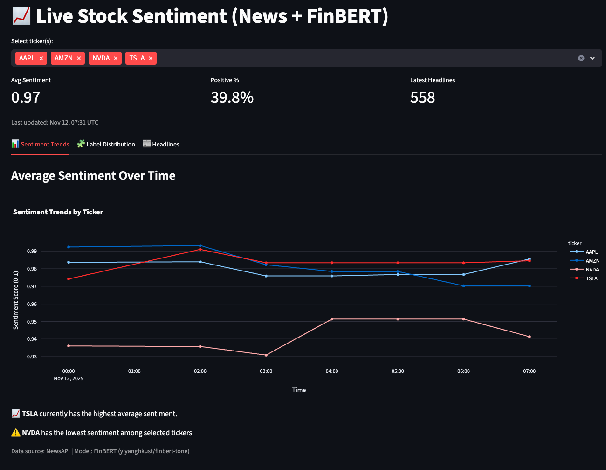
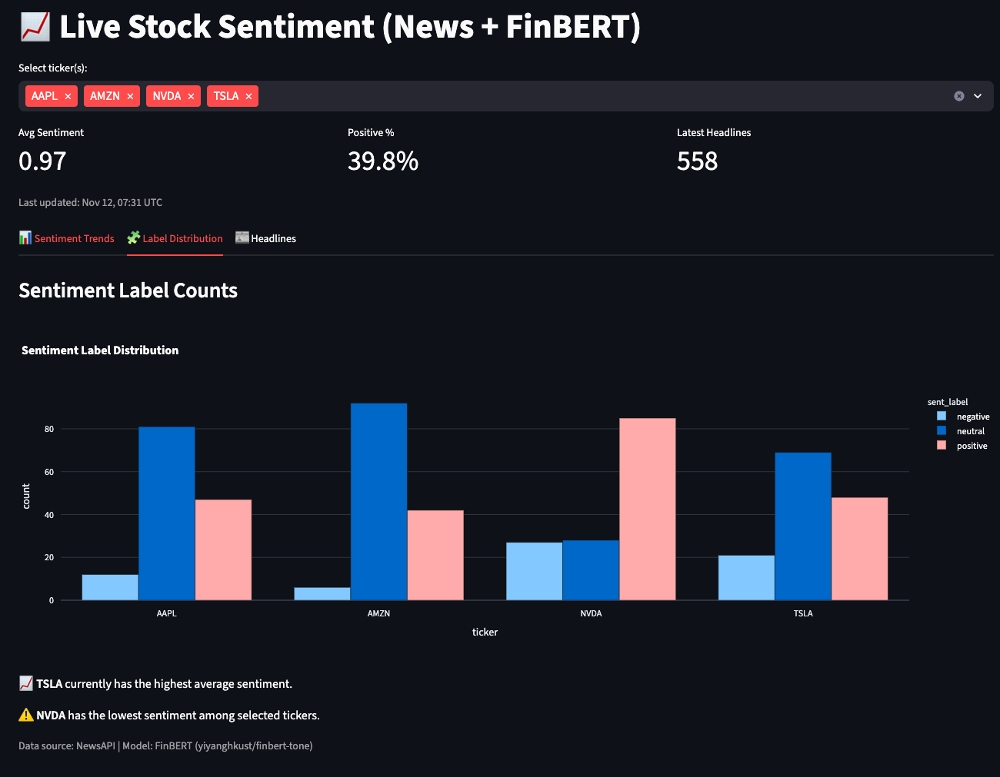
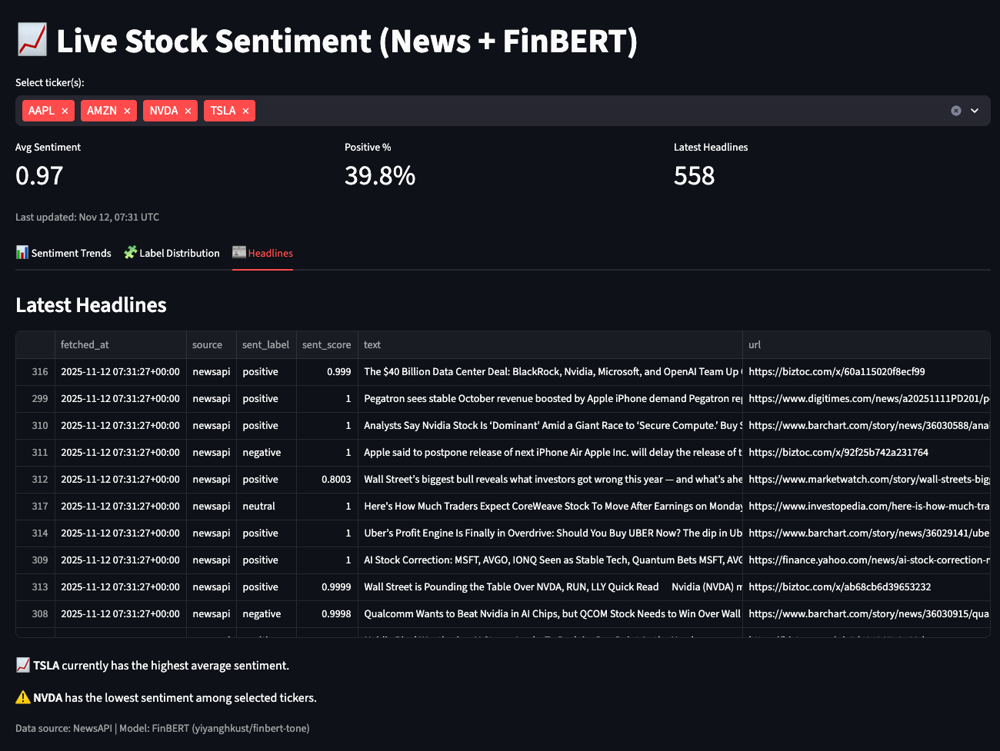

# stock-sentiment-analyzer

End-to-end pipeline for near‑real‑time stock sentiment from news (and later Twitter/forums). The project now supports multiple tickers, rolling sentiment tracking over time, and a live Streamlit dashboard. It ingests live headlines via NewsAPI, scores them with FinBERT, and writes partitioned Parquet files plus a rolling `latest.parquet` snapshot. A Streamlit app visualizes sentiment over time and label counts.

## Project status (Nov 2025)
- **Data ingest (NewsAPI)**: live headlines for configurable tickers (AAPL default) — completed.
- **Sentiment model**: FinBERT (`yiyanghkust/finbert-tone`) batch scoring — completed.
- **Storage**: partitioned Parquet under `data/processed/sentiment/date=YYYY-MM-DD/part-*.parquet` and `data/processed/sentiment/latest.parquet` — completed.
- **Dashboard**: Streamlit app reads `latest.parquet` and shows time series + label counts + latest items — completed.
- **Environment**: `.env` with `NEWSAPI_KEY`, ignored by git — completed.

The project runs continuously via the streaming loop and visualizes historical sentiment across multiple tickers.

## Quickstart

### 0) Setup
```bash
python -m venv venv && source venv/bin/activate
pip install -r requirements.txt
echo 'NEWSAPI_KEY=YOUR_KEY' > .env
```

### 1) Start the stream loop (ingest → score → write)
```bash
python -m src.scripts.stream_loop
```
This will create partitioned Parquet files and update `data/processed/sentiment/latest.parquet` each cycle.

### 2) Launch the dashboard (Streamlit)
```bash
streamlit run streamlit_app.py
```

## Features

- **Ingestion**
  - `src/data_ingest/newsapi.py` → `fetch_news(ticker, page_size)` with simple query (`TICKER OR "Company Name"`).
  - Fallback to a small mock dataset if NewsAPI fails (e.g., bad key/network).
- **Sentiment Scoring**
  - `src/models/finbert_batch.py` exposes `FinBertScorer().score_texts(list[str])`.
  - Uses `top_k=None` (HF pipelines) to avoid deprecation from `return_all_scores`.
- **Streaming Loop**
  - `src/scripts/stream_loop.py`:
    - fetch → clean (drop blanks, de‑dup on `id`) → score → write parquet.
    - Writes partitioned files and updates `latest.parquet` snapshot for the dashboard.
- **Dashboard**
  - `streamlit_app.py`:
    - Reads `latest.parquet`.
    - Filter by ticker.
    - Line chart of sentiment over time.
    - Bar chart of label counts.
    - Table of latest headlines (with URLs when available).

## Dashboard Preview

**Sentiment Trends**


**Label Distribution**


**Latest Headlines**


## Data layout

- Partitioned data:
  ```
  data/
    processed/
      sentiment/
        date=YYYY-MM-DD/
          part-<unix_ts>.parquet
        latest.parquet
  ```
- Core schema (columns):
  ```
  id, source, ticker, text, created_at, fetched_at, author, url, lang,
  sent_label, sent_score, sent_pos, sent_neu, sent_neg
  ```

## Roadmap

- **P0 robustness**
  - Light logging (rows in/out, latency, warnings).
  - Simple retry/backoff on ingest errors.
- **P1 demo/usability**
  - Add snapshot for multiple tickers.
  - Toggle chart time axis to `created_at` (publication time) as default.
- **P2 production polish**
  - S3 sink (`s3fs`) with AWS creds in `.env`.
  - FastAPI service to expose `/score` and `/health` (Dockerized).
  - Optional: Kafka producer + Spark Structured Streaming consumer writing to S3.
  - Unit tests for ingest/scoring; GitHub Actions.

## Notes

- NewsAPI usage is subject to rate limits and license terms.
- For a more varied time axis in the chart, prefer `created_at` over `fetched_at` (publication vs. fetch time).
- Twitter/forums ingestion will be added as separate modules and merged into the same schema.
